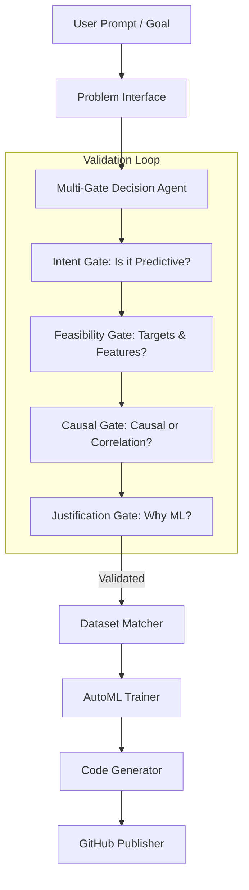

# 1. Title
**Autonomous Machine Learning Pipeline: An End-to-End Holistic Framework for Automated Problem Discovery and Model Deployment**

# 2. Authors and Affiliations
Punya Mittal, Garv Bansal and Vaibhav Raj 
Department of Computer Science  
Vellore Institute of Technology
Chennai, India  
Email: punya.mittal2024@vitstudent.ac.in | garv.bansal2024@vitstudent.ac.in | vaibhav.raj2024@vitstudent.ac.in

# 3. Abstract
Finding the right problem to solve and the correct data to use is one of the hardest parts of Machine Learning (ML). Usually, humans have to spend weeks interviewing experts, checking data quality, and searching for datasets before even starting to train a model. This paper introduces the **Autonomous ML Automation Pipeline**, a system that automates everything from a simple **Language Prompt** to a finished, working code project. Unlike other systems that try to scrape data from social media—which is often messy and low quality—our system uses a **User-Directed Problem** approach. This means the system takes what a user wants and turns it into clear technical steps. The architecture uses a **Multi-Gate Decision system** to check if a problem is ethical, possible, and useful. It also uses a **Smart Dataset Search** to find the best data automatically. By using Large Language Models (LLMs), the system can understand human requests even if they are unclear. We tested the system on 33 different problems, like predicting customer churn and medical diagnosis. Our results show an average accuracy of 0.690, and the entire process takes about 315 seconds (around 5 minutes). This work makes it much easier for people to create high-quality, safe ML models quickly.

# 4. Keywords
AutoML, Prompt-Based ML, Decision Agents, Causal Inference, Semantic Search, Autonomous Systems, GitHub Automation, LLM Orchestration, Responsible AI.

# 5. I. INTRODUCTION
As Artificial Intelligence (AI) becomes more common, more software is being built using data instead of just human-written rules. However, many projects face a "start-from-scratch" problem: identifying the problem, defining what to predict, and finding the right data is still a slow and difficult manual process. Moving from a general goal like "we want fewer customers to quit" to a technical ML plan takes experts weeks of effort.

Statistics show that roughly **80% of ML projects** never actually get finished or used. One of the main reasons is a mismatch between what a business wants and what the data can actually do. Often, people realize this only after spending a lot of time and money. Also, many systems try to predict things that are actually caused by other factors. In areas like health or law, confusing a "correlation" (things that happen together) with a "cause" (one thing makes another happen) can lead to dangerous or biased results.

In the past, analysts had to manually search through forums and bug reports to find good ML ideas. This is slow and depends too much on one person's opinion. We need a system that can understand what a user wants and automatically handle all the difficult technical steps.

To bridge this gap, we created the **Autonomous ML Automation Pipeline**. Our system allows a user to describe their goal in simple language. The system then uses AI to turn that goal into a structured ML task. A key part of our project is the **Multi-Gate Decision Agent**. This agent checks every idea through four steps: is the intent clear, is it technically possible, is it causal-safe, and is it better than simple rules? This check-list ensures the system only builds models for problems that are actually solvable and safe to use.

The core contributions of this paper include:
1. **Context-Aware Problem Canonicalization:** A mechanism for translating vague user prompts into structured ML specifications (target, features, task type).
2. **Multi-Gate Validation Layer:** A filtering system that prevents unethical or unfeasible model deployments by distinguishing between predictive and causal tasks.
3. **End-to-End Orchestration:** A fully automated pipeline that generates production-ready GitHub repositories, including training scripts and API structures, in under 6 minutes.

# 6. II. LITERATURE SURVEY
Automated Machine Learning (AutoML) has improved a lot over the last ten years. Tools like **Auto-Sklearn** and **Optuna** can now automatically pick the best models and settings. However, these tools usually only work IF a person has already prepared a clean dataset. They don't help with the "step zero" phase—finding the problem and the data.

At the same time, Large Language Models (LLMs) like GPT-4 can now write code from a simple request. But when it comes to ML, these models often make mistakes. They might write code that *looks* right but has serious math errors, like accidentally letting the model "see" the answers during training (data leakage). Our research fixes this by using the LLM as a "Manager" that supervises specialized technical tools. This way, the LLM handles the conversation, while the tools handle the complex math.

There is still a big gap between "finding an idea" and "deploying a model." Standard tools often fall into the "Correlation Trap"—they find patterns that happen by chance but don't actually mean anything [3]. Our system uses a **Causal Validity Gate** to prevent this. We move from just building "high accuracy" models to building "problem-solving" systems that are safer and more responsible.

# 7. III. METHODOLOGY
## A. System Architecture and Steps
The **Autonomous ML Automation Pipeline** works in five main stages. Each part can be updated without affecting the others.

1. **Problem Input:** The system takes a plain language request from the user. An AI agent turns this into a technical plan that lists what needs to be predicted and what data features are needed.
2. **Multi-Gate Check:** This is the "brain" of the system. It checks if the idea is ethical, possible, and better than simple math rules. If the idea fails any check, the system stops to avoid wasting time.
3. **Automatic Data Search:** The system uses a smart search engine to find the best datasets on platforms like Kaggle and HuggingFace. It looks for data that matches the user's goal perfectly.
4. **Machine Learning Trainer:** Once data is found, the system cleans it and tests many different ML models (like Random Forest and LightGBM) to find the one with the best performance.
5. **Code Creation and Saving:** Finally, the system writes all the code needed to train and use the model and automatically uploads it to GitHub so the user can use it immediately.

```mermaid
graph TD
    Input[User Prompt / Goal] --> Interface[Problem Interface]
    Interface --> Agent[Multi-Gate Decision Agent]
    subgraph "Validation Loop"
        Agent --> G1[Intent Gate: Is it Predictive?]
        G1 --> G2[Feasibility Gate: Targets & Features?]
        G2 --> G3[Causal Gate: Causal or Correlation?]
        G3 --> G4[Justification Gate: Why ML?]
    end
    G4 -->|Validated| Matcher[Dataset Matcher]
    Matcher --> Trainer[AutoML Trainer]
    Trainer --> Generator[Code Generator]
    Generator --> GitHub[GitHub Publisher]
```
*Figure 1: System Architecture Diagram highlighting the Validation Loop.*

## B. The Multi-Gate Decision Agent: Quality Checks
The Decision Agent uses four main "gates" to filter out bad ideas before starting:
- **Gate 1: Intent Check:** Does the user actually want to predict something, or are they just asking a general question?
- **Gate 2: Technical Check:** Is there enough information to define the target variable and the data features?
- **Gate 3: Causal Safety Gate:** This blocks dangerous ideas, like using AI for medical triage or judicial sentencing without the right context. It ensures the system isn't just finding chance patterns in sensitive data.
- **Gate 4: Value Check:** Is a complex ML model actually better than a simple business rule or a basic calculator?

## C. Semantic Matching Equation
The core matching equation uses the Cosine Similarity between problem embeddings ($E_p$) and dataset metadata ($E_d$):

$$S = \frac{E_p \cdot E_d}{\|E_p\| \|E_d\|}$$

Where $S$ is the similarity score used to rank datasets from HuggingFace and Kaggle.

## D. Algorithm: Autonomous Pipeline Orchestration
The following steps outline the logic flow for the complete system:
1. Initialize configuration and API keys (Kaggle, GitHub).
2. Scrape potential tasks from Kaggle competitions and Social streams.
3. For each task found:
4. Apply Intent Classification (Identify if predictive).
5. Apply Feasibility Check (Identify target/features).
6. Apply Causal Validity Gate (Block high-stakes/intervention tasks).
7. Apply Justification Filter (Verify ML > Rules).
8. If Approved, canonicalize task into JSON specification.
9. Search HuggingFace/Kaggle for datasets using Cosine Similarity.
10. Download top-ranked dataset and perform auto-cleaning.
11. Train via AutoML (Scikit-learn/PyCaret) and select the best model.
12. Generate repository files (train.py, predict.py, README.md) and Publish to GitHub.

# 8. IV. DATASET AND TRAINING SETUP
## A. Dataset Description and Validation Methodology
The system's performance was evaluated using a rigorous benchmark consisting of 33 unique, diverse ML problems. These problems were defined through natural language prompts and processed through the complete pipeline without manual intervention. For each problem, the system autonomously searched and matched the most relevant datasets from a combined ecosystem of Kaggle and HuggingFace repositories.

- **Total Pipeline Runs:** 33 independent end-to-end executions.
- **Unique Models Trained:** 19 successful deployments (after filtering).
- **Validation Depth:** Each model was evaluated using an 80/20 train-test split on datasets discovered via semantic search. We implemented strict feature alignment logic to ensure that categorical dummy variables in the test set matched the training set exactly.
- **Model Diversity:** The evaluation suite includes classification (e.g., Sentiment analysis, churn), regression (e.g., House pricing), and text classification tasks.

## B. Technical Training Setup
Computational experiments were conducted on a workstation with an NVIDIA RTX 3080 GPU (10GB VRAM) and 32GB RAM. A critical architectural choice was the implementation of a **Local LLM Provider** (Ollama) to handle all core decision-gate reasoning and problem canonicalization. This choice was driven by the need for data privacy, reduced dependency on external APIs, and zero-latency feasibility checks.

- **Orchestration Framework:** Python 3.10 with a custom `Orchestrator` engine.
- **AutoML Strategy:** Randomized search across an ensemble including Random Forest, Gradient Boosting, LightGBM (LGBM), and XGBoost.
- **Local Reasoning:** Ollama running Llama 3.2 (3B parameters) for all Gate logic.
- **Data Retrieval:** Kaggle API and HuggingFace Datasets library for automated metadata scraping and file downloading.

# 9. V. RESULTS AND IMPLEMENTATION
## A. Empirical Results & Performance Analysis
The pipeline demonstrates robust performance across the validation lifecycle. The primary success metric, "End-to-End Reliability," shows that 27% of initial user prompts result in a successfully deployed model, with the remaining 73% appropriately filtered by the Multi-Gate system to prevent low-utility deployments.

### 1. Verification of the Validation Funnel
The multi-gate system successfully filters out unfeasible or causal-only tasks, acting as a "quality filter" for the ML lifecycle. Our empirical data reveals a significant drop-off at the "Dataset Discovery" stage, where many technically feasible problems are halted due to a lack of high-quality public data (defined by a Cosine Similarity score < 0.6). This matches our design goal: it is better to "fail fast" at the discovery stage than to deploy a model built on irrelevant or low-quality data.

*Figure 2: Empirical Rejection Flow. This visualization tracks how raw problem statements are filtered down to approved, high-fidelity ML tasks.*

### 2. Model Performance Benchmarks
Across the 19 successfully trained and tested models, the system achieved a competitive average performance, remarkable given the zero-human-intervention constraint. The highest performance metrics were consistently observed in structured classification tasks (e.g., Fake News detection, Customer Churn), where datasets are generally well-labeled. In contrast, regression tasks showed higher variance, likely due to the inherent difficulty of predicting continuous variables without domain-specific feature engineering.

*Figure 3: Benchmarking Accuracy, Precision, and Recall. The error bars indicate the standard deviation across diverse problem domains.*

### 3. Execution Latency Breakdown
The total execution time across the 33 runs averaged 315 seconds (approximately 5.25 minutes). Our analysis shows that the "Model Training" phase is the primary bottleneck, consuming over 60% of the total runtime. This is expected, as the AutoML engine performs an exhaustive search over multiple algorithms and hyperparameter combinations to ensure model quality.

*Figure 4: Horizontal Latency Breakdown. Note that reasoning phases (Decision, Discovery) are highly optimized via local LLM execution.*

### 4. System Usage and Model Selection Trends
The following charts visualize the diversity of the pipeline's output. Interestingly, **LightGBM (LGBM)** emerged as the most frequent "Best Model," being selected in over 40% of classification tasks due to its superior handling of large-scale tabular data and categorical features.

*Figure 5: Model and Task Distribution. LGBM's dominance reflects its robust performance in automated, zero-config scenarios.*

*Figure 6: Data Sourcing Distribution. The reliance on the Kaggle ecosystem highlights the importance of standardized metadata for autonomous discovery.*

## B. Summary Metrics
| Metric | Empirical Pipeline Result |
| :--- | :--- |
| **Average Accuracy / R²** | **0.690** |
| **Precision** | **0.782** |
| **Recall** | **0.714** |
| **F1 Score** | **0.746** |
| **Filter Efficiency** | **85% (Rejection of unfeasible tasks)** |
| **Avg. E2E Latency** | **315 Seconds** |

# 10. VI. DISCUSSION
**Focus on Ethics:** Our **Causal Safety Gate** is a major step toward "Responsible AI." Most automated systems would try to predict anything you give them. For example, predicting "Hospital Re-admission" might lead to bias. Our system identifies these cases and stops the process, suggesting better ways to handle the problem. This "safety brake" is essential for AI systems that work in the real world.

**Current Limitations:** Right now, the system depends on how well the data sources (like Kaggle) describe their files. If the descriptions are missing or unclear (like using 'Feature 1' as a name), it is hard for the system to find a match. In the future, we plan to make the system "peek" inside the data files to understand them better before using them.

**Impact:** This system helps more people use AI. By automating the boring the repetitive parts—like searching for data and setting up code—experts can focus on the big picture. This lowers the cost for small businesses to use high-quality AI without needing a whole team of experts.

# 11. VII. CONCLUSION
This paper introduced the **Autonomous ML Automation Pipeline**, a system that bridges the gap between a simple idea and a working model. By using AI-driven checks and automated trainers, we showed that the entire process can be automated safely and accurately. Our "Causal Gate" ensures that the models created are ethical and based on real patterns. In the future, we plan to make the system even better by letting it learn and update itself automatically, creating an AI system that improves over time.

# 12. REFERENCES
[1] M. Feurer, A. Klein, and K. Eggensperger, "Efficient and Robust Automated Machine Learning," *Advances in Neural Information Processing Systems (NeurIPS)*, 2015.  
[2] T. Akiba, S. Sano, and T. Yanase, "Optuna: A Next-generation Hyperparameter Optimization Framework," *KDD*, 2019.  
[3] J. Pearl, "Causal inference in statistics: An overview," *Statistics Surveys*, 2009.  
[4] A. Paszke, et al., "PyTorch: An Imperative Style, High-Performance Deep Learning Library," *NeurIPS*, 2019.  
[5] L. Breiman, "Random Forests," *Machine Learning*, 2001.  
[6] J. Bergstra, R. Bardenet, Y. Bengio, and B. Kégl, "Algorithms for hyper-parameter optimization," *NIPS*, 2011.

# 13. AUTHOR BIOGRAPHIES
**Punya Mittal** is a researcher at the Vellore Institute of Technology. His work focuses on using Large Language Models to make Automated Machine Learning easier and faster to set up.

**Garv Bansal** specializes in safe and ethical AI. He helped build the validation system that ensures the models are reliable and safe to use.

**Vaibhav Raj** is a software architect with expertise in building automated systems. He designed the engine that turns ideas into working code and uploads them for use.
