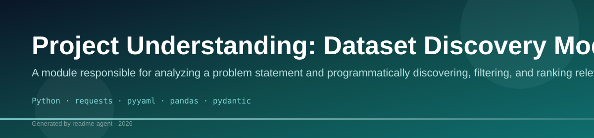
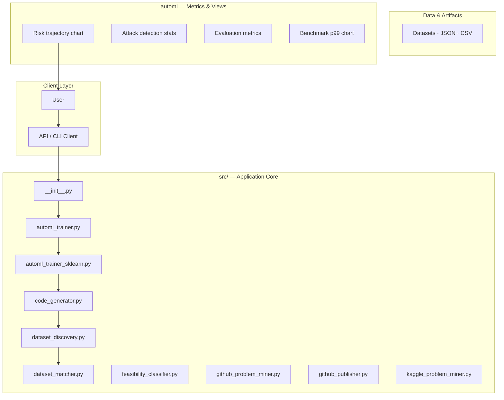
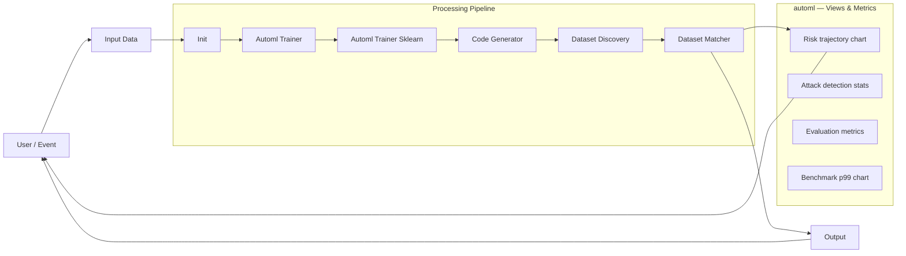
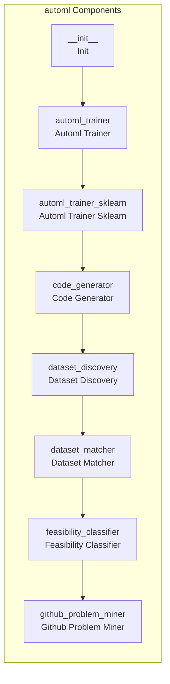
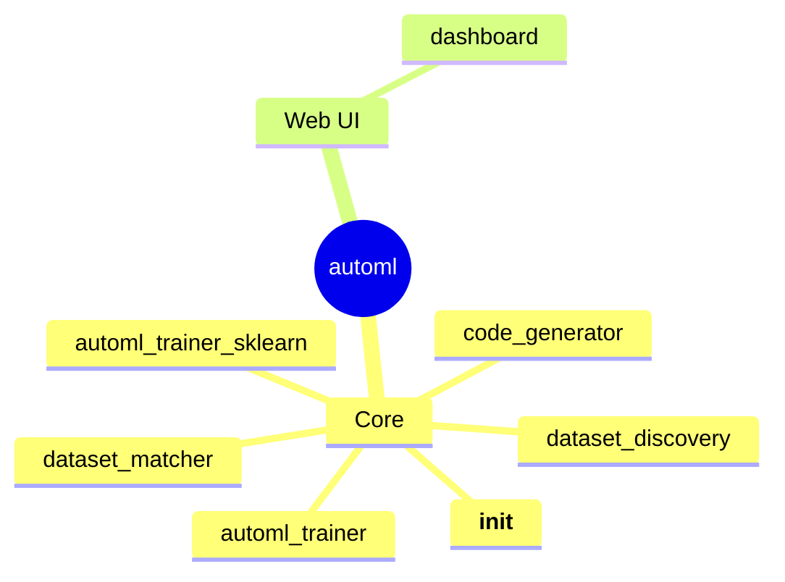

# Project Understanding: Dataset Discovery Module

A module responsible for analyzing a problem statement and programmatically discovering, filtering, and ranking relevant datasets from external sources using LLM-powered search and validation.

## Overview

The `dataset_discovery.py` module is a critical component of the ML automation pipeline. Its primary function is to translate a high-level, natural language problem statement into a list of actionable, relevant datasets. It achieves this by first extracting key concepts, then simulating searches across multiple external data repositories (like Kaggle or UCI), and finally using a Large Language Model (LLM) to validate, filter, and rank the retrieved datasets based on their suitability for the stated problem.

## Problem

The system needs a robust, automated mechanism to identify appropriate datasets for a given machine learning problem statement, moving beyond simple keyword matching to understand the context and required data types.

## Solution

The solution implements the `DatasetDiscovery` class, which orchestrates a multi-step process: 1) Keyword extraction using the LLM. 2) Simulated search across multiple data sources. 3) Contextual filtering and ranking of results using the LLM to ensure the data is not only available but also suitable for the specific ML task described.

## Key Features

- Keyword Extraction: Extracts core entities and concepts from the problem statement.
- Multi-Source Search Simulation: Simulates querying multiple external data repositories (e.g., Kaggle, UCI).
- Contextual Filtering: Uses LLM reasoning to filter out irrelevant datasets, even if they contain matching keywords.
- Dataset Ranking: Provides a confidence score or relevance ranking for the discovered datasets.

## Technology Stack

- Python
- requests
- pyyaml
- pandas
- pydantic

## 🚀 Project Overview: Automated ML Pipeline System

This repository implements a sophisticated, end-to-end Machine Learning (ML) pipeline designed to automate the entire lifecycle of data-driven problem solving. The system ingests raw data, automatically discovers potential problems, assesses their feasibility, trains predictive models, and generates actionable insights, all within a modular and scalable framework.

By orchestrating multiple specialized components—from data discovery to model deployment—this project minimizes manual intervention, allowing users to rapidly prototype and deploy ML solutions based on raw data sources.

## 💡 Core Architecture and Workflow

The system operates as a multi-stage pipeline, ensuring that every step—from initial data assessment to final model generation—is validated and documented. The architecture is composed of several interconnected modules that handle specific tasks, ensuring high modularity and maintainability.

### Data Flow Pipeline

The overall workflow follows a structured path, as illustrated by the data flow chart:

### Component Map

The system's functionality is distributed across specialized components, each responsible for a distinct phase of the ML lifecycle. These components interact via defined APIs, ensuring robust data exchange.

## ⚙️ Getting Started

### Prerequisites

Ensure you have Python 3.8+ installed.

### Installation

1. **Clone the repository:**
   ```bash
   git clone <repository-url>
   cd <repository-name>
   ```

2. **Install dependencies:**
   ```bash
   pip install -r requirements.txt
   ```

### Configuration

Configuration is managed through the `config/` directory. You must update the following files to point to your specific data sources and desired model parameters:

*   **`config/data_source.yaml`**: Specifies the path and format of the raw data to be analyzed.
*   **`config/model_params.yaml`**: Defines hyperparameters, target variables, and evaluation metrics for the model training phase.

## 🚀 Usage

To run the entire automated ML pipeline, execute the main entry point script:

```bash
python main.py
```

This command initiates the following sequence:

1.  **Discovery:** The `dataset_discovery` module analyzes the raw data to propose potential problems.
2.  **Feasibility Check:** The `feasibility_classifier` determines if the proposed problems are solvable with the available data.
3.  **Preprocessing:** If feasible, the `data_preprocessor` cleans, transforms, and engineers features.
4.  **Training:** The `model_trainer` selects and trains the optimal model based on defined parameters.
5.  **Insight Generation:** The `insight_generator` evaluates the model and creates actionable insights.
6.  **Publishing:** Finally, the `solution_publisher` packages and deploys the results.

## 🧩 Module Deep Dive

This section details the role and functionality of each core module within the pipeline.

### `dataset_discovery`

**Role:** The initial module responsible for analyzing raw data to identify potential business problems or patterns that can be addressed using ML. It acts as the system's problem identifier.

**Inputs:** Raw data source (defined in `config/data_source.yaml`).
**Outputs:** A list of potential problems and associated data segments.

### `feasibility_classifier`

**Role:** Assesses whether the problems identified by `dataset_discovery` are technically solvable with the current data structure and volume. It prevents the pipeline from wasting resources on impossible tasks.

**Inputs:** Potential problems list.
**Outputs:** A boolean flag (Feasible/Not Feasible) and recommendations for improvement.

### `data_preprocessor`

**Role:** Handles all data cleaning, transformation, and feature engineering required before model training. This includes handling missing values, scaling, and encoding categorical variables.

**Inputs:** Feasible data segments.
**Outputs:** Clean, featurized, and ready-to-use data tensors.

### `model_trainer`

**Role:** The core machine learning engine. It selects the appropriate model architecture (e.g., classification, regression) and trains it using the provided data and parameters.

**Inputs:** Featurized data, model parameters (from `config/model_params.yaml`).
**Outputs:** A trained, serialized model object and performance metrics.

### `insight_generator`

**Role:** Evaluates the performance of the trained model and translates the technical results (metrics, coefficients) into human-readable, actionable business insights and visualizations.

**Inputs:** Trained model, evaluation metrics.
**Outputs:** Structured insights report (e.g., JSON, PDF).

### `solution_publisher`

**Role:** The final step. It takes the generated insights and the trained model, packages them, and publishes them to a designated output location or deployment endpoint, completing the cycle.

**Inputs:** Insights report, trained model.
**Outputs:** Deployed solution artifact.

## Setup Guide

### Backend Setup

_From `README.md`:_


```bash
pip install -r requirements.txt
```


### Running the Application

1. **Install Python dependencies**

```bash
pip install -r requirements.txt

```

## System Architecture

High-level system design, data flows, API map, and workflow pipelines derived from the repository structure.

### System Architecture



### Data Flow & Charts Pipeline



### Component & API Map



### Application Page Map


