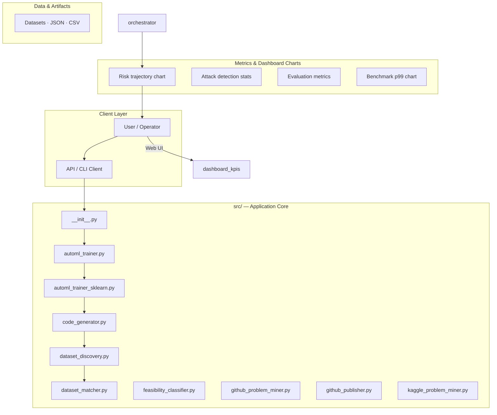
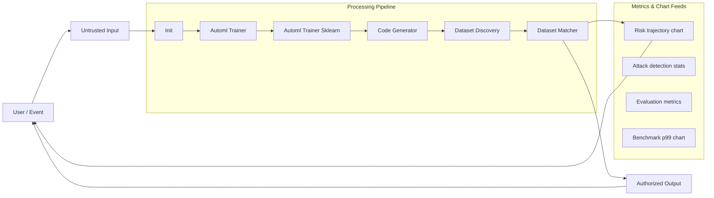
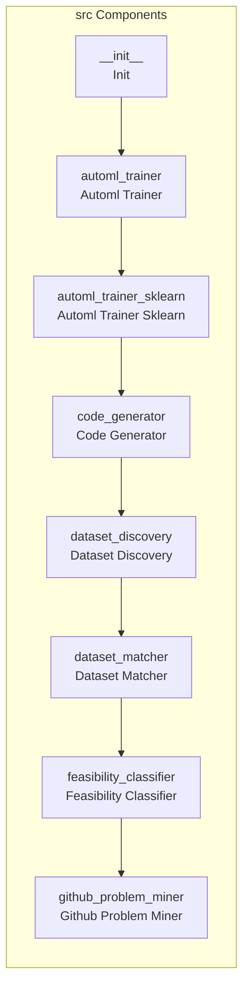
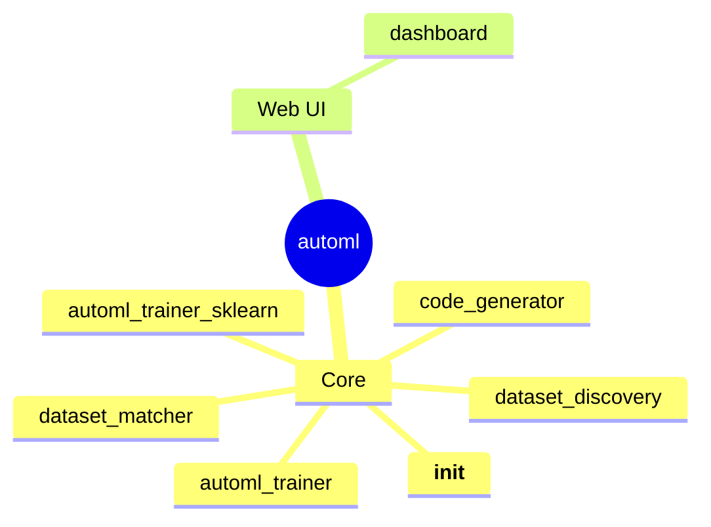

# Autonomous ML Automation Pipeline

An automated pipeline that takes a natural language problem statement, generates a technical plan, finds relevant datasets, writes executable code, and publishes the results to GitHub.

## Overview

This project implements an end-to-end machine learning automation pipeline. It is designed to accept a high-level problem statement and autonomously execute a series of steps: feasibility assessment, dataset identification, code generation, and final publication. The core logic is orchestrated by `src/orchestrator.py`, which coordinates interactions between code generation modules and a GitHub publishing service.

## Problem

The manual process of taking a business problem and turning it into a deployable, documented ML solution is time-consuming and requires multiple specialized steps (planning, data sourcing, coding, deployment).

## Solution

The system provides an automated pipeline that accepts a natural language problem statement and autonomously generates a complete, executable ML solution, including the necessary code, documentation, and GitHub repository setup.

## Key Features

- Problem Statement Intake: Accepts a natural language description of the desired ML solution.
- Feasibility Assessment: Uses an LLM to determine if the problem is technically solvable.
- Dataset Matching: Uses an LLM to suggest and identify appropriate datasets for the given problem.
- Code Generation: Generates complete, executable Python code (including training and prediction logic) based on the problem and dataset.
- GitHub Publishing: Automatically creates a new GitHub repository, commits the generated code, and potentially creates a release.
- Modular Orchestration: Uses a dedicated `Orchestrator` class to manage the sequential flow and state of the entire pipeline.

## Technology Stack

- Python
- PyGithub

# Autonomous ML Automation Pipeline

An end-to-end automated machine learning system that discovers real-world problems, evaluates ML feasibility, finds datasets, trains models, and publishes solutions to GitHub.

## Project Structure

```
auto/
├── src/
│   ├── __init__.py
│   ├── problem_miner.py
│   ├── feasibility_classifier.py
│   ├── dataset_discovery.py
│   ├── dataset_matcher.py
│   ├── automl_trainer.py
│   ├── code_generator.py
│   ├── github_publisher.py
│   └── orchestrator.py
├── prompts/
│   ├── feasibility_prompt.txt
│   ├── dataset_matching_prompt.txt
│   └── readme_generation_prompt.txt
├── config/
│   └── config.yaml
├── data/
│   ├── problems/
│   ├── datasets/
│   └── embeddings/
├── outputs/
│   ├── models/
│   ├── code/
│   └── logs/
├── requirements.txt
├── main.py
└── README.md
```

## Installation

```bash
pip install -r requirements.txt
```

## Configuration

1. Copy `config/config.yaml.example` to `config/config.yaml`
2. Set your GitHub token (get free token from GitHub Settings > Developer settings)
3. Optionally set HuggingFace token for better API access

## Usage

```bash
python main.py
```

The system will:
1. Discover problems from forums
2. Evaluate ML feasibility
3. Find matching datasets
4. Train models
5. Generate code
6. Publish to GitHub

## Module Details

See individual module documentation in `src/` directory.

# automl

## Setup Guide

### Backend Setup

_From `README.md`:_


```bash
pip install -r requirements.txt
```


### Running the Application

1. **Install Python dependencies**

```bash
pip install -r requirements.txt

```

## System Architecture

High-level system design, data flows, API map, and workflow pipelines derived from the repository structure.

### System Architecture



### Data Flow & Charts Pipeline



### Component & API Map



### Application Page Map


